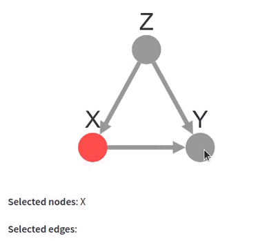

# st-cytoscape

`st-cytoscape` is a [Streamlit](https://streamlit.io) component to embed a [Cytoscape.js](https://js.cytoscape.org/) graph and get the selected nodes and edges in return.



A more advanced example can be seen live [here](https://share.streamlit.io/vivien0000/causal-simulator/main/app.py) ([code](https://github.com/vivien000/causal-simulator)).

## Installation

```bash
pip install st-cytoscape
```

## Quickstart

```python
import streamlit as st
from st_cytoscape import cytoscape

elements = [
    {"data": {"id": "X"}, "selected": True, "selectable": False},
    {"data": {"id": "Y"}},
    {"data": {"id": "Z"}},
    {"data": {"source": "X", "target": "Y", "id": "X➞Y"}},
    {"data": {"source": "Z", "target": "Y", "id": "Z➞Y"}},
    {"data": {"source": "Z", "target": "X", "id": "Z➞X"}},
]

stylesheet = [
    {"selector": "node", "style": {"label": "data(id)", "width": 20, "height": 20}},
    {
        "selector": "edge",
        "style": {
            "width": 3,
            "curve-style": "bezier",
            "target-arrow-shape": "triangle",
        },
    },
]

selected = cytoscape(elements, stylesheet, key="graph")

st.markdown("**Selected nodes**: %s" % (", ".join(selected["nodes"])))
st.markdown("**Selected edges**: %s" % (", ".join(selected["edges"])))
```

## Usage

**cytoscape (elements,
    stylesheet,
    width="100%",
    height="300px",
    layout={"name": "fcose", "animationDuration": 0},
    selection_type="additive",
    user_zooming_enabled=True,
    user_panning_enabled=True,
    min_zoom=1e-50,
    max_zoom=1e50,
    key=None
)**

Embeds a Cytoscape.js graph and returns a dictionary containing the list of the ids of selected nodes ("nodes" key) and the list of the ids of the selected edges ("edges" key)

### Parameters

- `elements` (list): the list of nodes and edges of the graph
    (cf. https://js.cytoscape.org/#notation/elements-json)
- `stylesheet` (list): the style used for the graph (cf. https://js.cytoscape.org/#style)
- `width` (string): the CSS width attribute of the graph's container
- `height` (string): the CSS height attribute of the graph's container
- `layout` (dict): the layout options for the graph (cf. https://js.cytoscape.org/#layouts)
- `seletion_type` (string: "single" or "additive"): cf. https://js.cytoscape.org/#core/initialisation
- `user_zooming_enabled` (boolean): cf. https://js.cytoscape.org/#core/initialisation
- `user_panning_enabled` (boolean): cf. https://js.cytoscape.org/#core/initialisation
- `min_zoom` (float): cf. https://js.cytoscape.org/#core/initialisation
- `max_zoom` (float): cf. https://js.cytoscape.org/#core/initialisation
- `key` (str or None): an optional key that uniquely identifies this component. If this is None, and the component's arguments are changed, the component will be re-mounted in the Streamlit frontend and lose its current state

## Advanced layout

`st-cytoscape` includes `fCoSE`, a Cytoscape.js [extension](https://github.com/iVis-at-Bilkent/cytoscape.js-fcose) offering an elegant force-directed layout. You can then use `{"name": "fcose", ...}` as an argument for `layout`, instead of Cytoscape.js' [native layout options](https://js.cytoscape.org/#layouts).

A nice feature of `fcose` is that it can enforce [placement constraints](https://github.com/iVis-at-Bilkent/cytoscape.js-fcose#documentation), such as:

```python
layout = {"name": "fcose", "animationDuration": 0}
layout["alignmentConstraint"] = {"horizontal": [["X", "Y"]]}
layout["relativePlacementConstraint"] = [{"top": "Z", "bottom": "X"}]
layout["relativePlacementConstraint"] = [{"left": "X", "right": "Y"}]
```

You can now similarly use the `klay` layout, using the `cytoscape-klay` add-on for Cytoscape.js - [extension](https://github.com/cytoscape/cytoscape.js-klay).  To use it simply name it in the layout:

```Python
layout = {"name": "klay"}
```
